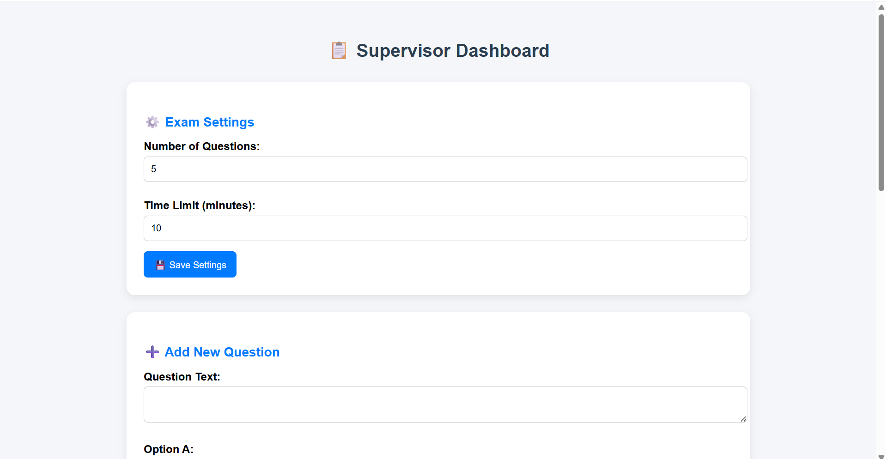
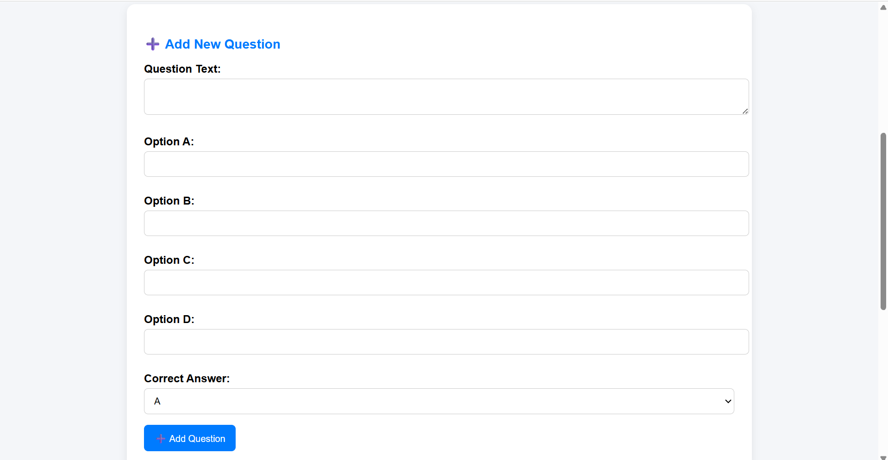
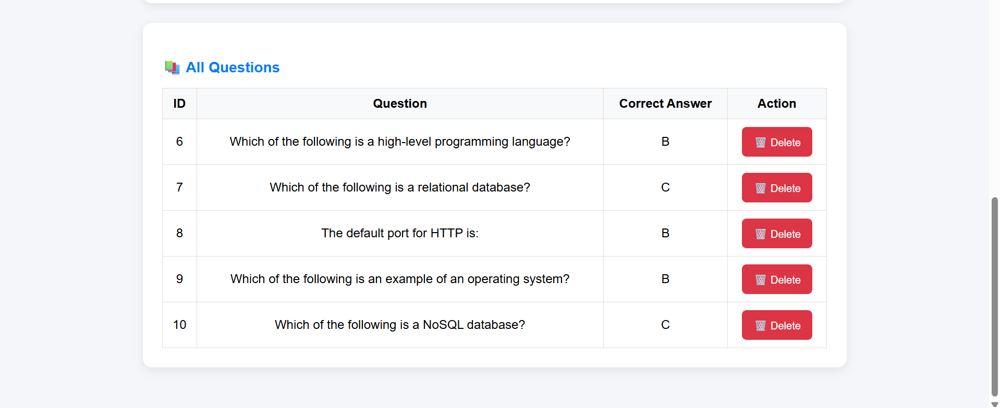

## Exam-Management-System

A simple and practical online **exam management system** built with **PHP** and **MySQL**.
It provides a student interface for taking exams and a supervisor dashboard for managing questions and settings efficiently.
---

## Features

- **Login as Student or Supervisor**
-  **Student Role**:
  - View exam details (time limit, instructions, profile).
  - Start the exam with countdown timer.
  - Answer multiple-choice questions.
  - Navigate between questions.
  - Submit exam at the end.
-  **Supervisor Role**:
  - **Manage exams and students (future scope)**.
    - **Exam Timer** with automatic countdown.
    - **Data stored securely in MySQL**.
    - Add questions with multiple choices and correct answer.
    - Set the number of questions .
    - View all questions and delete unwanted ones.
---
## Technologies Used

**Frontend:** HTML, CSS, JavaScript

**Backend:** PHP

**Database:** MyAQL

---

## Installation

1. Clone the repository:

```bash
git clone https://github.com/YourUsername/exam-management-system.git

```
2.Create a MySQL database named exam_system.

3.Import the exam_system.sql file into your database.

4.Place the project folder inside your local server directory (e.g., XAMPP htdocs).

5.Open your browser and go to:

```bash
http://localhost/exam-management-system/
```

## 🖼️ Screenshots

### 🔐 Login Page


### 👤 Profile Page


### 📝 Exam Start Page


### ⏳ Exam Question Page with Timer


### 📤 Submit Exam Page


### 🛠️ Supervisor Dashboard




---


## 📸 Demo
- Coming soon: Online demo link (via free hosting).  
- Alternatively, see screenshots above.


---

## 👩‍💻 Author
Developed by **Manal Bafaraj**  
[LinkedIn](https://www.linkedin.com/in/manal-bafaraj-799123264/) | [GitHub](#)  

